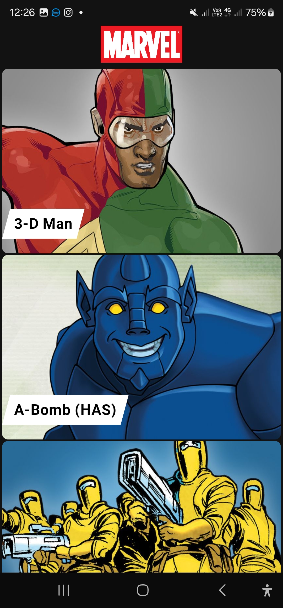

# Marvel Characters Explorer

Welcome to the Marvel Characters Explorer app! This application allows users to browse and explore the Marvel library of characters by interacting with the [Marvel API](http://developer.marvel.com/).

## Features

- **List of Characters**: Displays a list of Marvel characters fetched from the API using Android Paging for seamless pagination.
- **Character Details**: Shows detailed information about selected characters, including lazy-loaded images for comics, series, stories, and events.
- **Error and Empty States**: Handles error views and empty states gracefully.

---

## User Flow

1. **Character List View**:
    - Fetch and display a paginated list of Marvel characters.
    - On reaching the end of the list, additional data is loaded automatically.
2. **Character Details View**:
    - Displays detailed information about a selected character.
    - Dynamically loads images for additional sections (comics, series, stories, events).

---

## Tech Stack

### **UI Framework**
- **Jetpack Compose**: Used for building modern, declarative UI components.

### **Architecture**
- **Clean Architecture**: Ensures separation of concerns.

### **Dependency Injection**
- **Dagger Hilt**: Manages dependency injection for the project.

### **Asynchronous Programming**
- **Kotlin Coroutines**: Used for reactive programming and threading control.

### **Paging**
- **Android Paging Library**: Handles the pagination mechanism for the character list.

### **Image Loading**
- **Compose Glide**: Efficiently loads and displays images.

### **Secure Key Management**
- **NDK (Native Development Kit)**: Utilized to securely store public and private keys.
    - **Why NDK?**: Storing sensitive keys in the native layer makes them harder to extract compared to Java/Kotlin layers. However, to further secure the keys, obfuscation (e.g., ProGuard or R8) and additional encryption should be applied.

---

## Screenshots

| Splash Screen                                    | Character List                                 | Character Details                                    | Comics Preview                                    |
|--------------------------------------------------|------------------------------------------------|------------------------------------------------------|---------------------------------------------------|
|  |  |  |  |

---

## Installation

1. Clone this repository:
   ```bash
   git clone https://github.com/hima2020/StcMarvelTask.git
   ```
2. Open the project in Android Studio.
3. Sync the Gradle files.
4. Build and run the project on an emulator or physical device.

---

## APK Download

You can download the APK file from [apk](https://github.com/hima2020/StcMarvelTask/blob/main/apk/apk_file.apk).

---

## Use Cases

1. **Explore Characters**:
    - Users can scroll through a list of Marvel characters with infinite scrolling.
2. **View Character Details**:
    - Access additional details about each character, including comics, series, and stories they are part of.

---

## Mock UI Reference

The app is designed based on this [mockup](https://marvelapp.com/279b309).

---

## Challenges & Notes

- **Time Constraints**: This application was developed in 24 hours.
- **UI Matching**: Due to limited resources, fonts, and dimensions from the mockup were approximated.
- **Security Measures**:
    - Public and private keys were stored securely using the NDK.
    - Additional security measures like obfuscation and encryption can be applied for enhanced security.

---

## How to Run

### Prerequisites

- Android Studio LadyBug (latest version).
- Marvel API keys:
    1. Generate API keys from [Marvel Developer Portal](http://developer.marvel.com/).
    2. Place the keys in the native layer using the NDK.

---

## Project Structure

```
app/
├── data/      # Data layer: API, DTOs, Repositories
├── domain/    # Domain layer: Use cases, Models
├── ui/        # Presentation layer: ViewModels, Compose UI
├── di/        # Dependency injection setup with Hilt
├── utils/     # Utility classes and extensions
```

---


### Contact
For questions or feedback, please contact [ibrahim.hany.2016@gmail.com].
